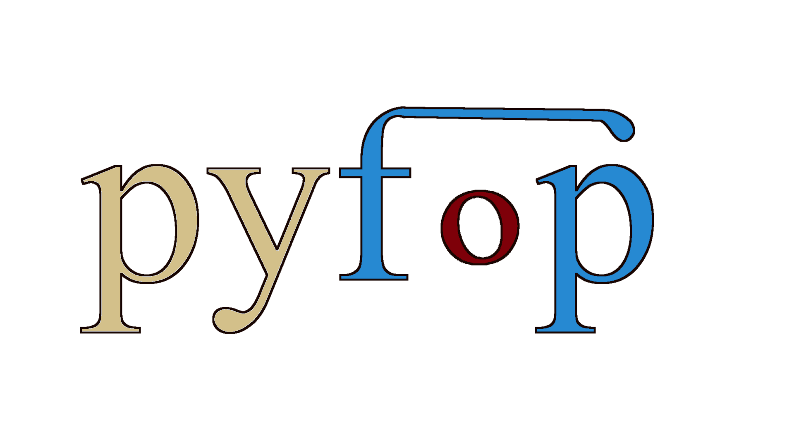

Implements 
[forward-oriented programming](https://papers.ssrn.com/sol3/papers.cfm?abstract_id=4180025)
in Python. This shares configuration arguments across multiple components
and determines their values *after* the main business logic.


[](https://codecov.io/gh/maniospas/pyfop)
[](https://pepy.tech/project/pyfop)

**Dependencies:** `makefun`<br/>
**Developer:** Emmanouil (Manios) Krasanakis<br/>
**Contant:** maniospas@hotmail.com


## Features
:alembic: Adapt arguments to usage context<br>
:surfer: Argument sharing between methods<br>
:rocket: Speed up library development<br>
:hammer_and_wrench: Easy adoption with decorators

## Quickstart
Enable lazy execution and automatically annotate arguments with defaults as aspects:
```python
from pyfop import lazy, autoaspects

@lazy
@autoaspects
def affine(x, scale=1, offset=0):
    return x*scale + offset
```
Produce results with python code:
```python
GM = (affine(2)*affine(8))**0.5
```
Set aspect values to previous code:
```python
print(GM(scale=3))  # 12
```

## Advanced features
<details>
<summary>Internal call of lazy methods while exposing their aspects.</summary>

```python
@lazy
@autoaspects
def gm(x, y, affine=affine):  # pass the method as an argument
    return (affine(x)*affine(y))**0.5

GM = gm(2, 8)
print(GM(scale=3))  # 12
```

</details>


<details>
<summary>Print list of aspects.</summary>

```python
print(GM.get_input_context(scale=3))
# context:
#	- scale:
#		 value: 3,
#		 priority: Priority.HIGH
#		 shares: 1
#	- offset:
#		 value: 1,
#		 priority: Priority.INCREASED
#		 shares: 4
```

</details>


<details>
<summary>Aspects are shared between everything contributing to the result</summary>

```python
@lazy
@autoaspects
def square(x, scale=1):
    return scale*x*x

print(affine(2)(scale=2))  # 4
print((affine(2)+square(1))(scale=2))  # 5
```

</details>

<details>
<summary>Priority-based selection between defaults</summary>

```python
@lazy
def logpp(x, offset=Aspect(1, Priority.INCREASED)):
    import math
    return math.log(x+offset)/math.log(2)

result = affine(2)+log(3)
print(result(scale=2))  # 5+2=7
```

</details>


<details>
<summary>Toggle caching.</summary>

```python
@lazy  # automatically performs caching
def inc(x):
    print("running")
    return x+1

print(inc(2)())
# running
# 3 
print(inc(2)())
# 3
print(inc(3)())
# running
# 4
```

```python
@lazy_no_cache  # disables caching
def inc(x):
    print("running")
    return x+1

print(inc(2)())
# running
# 3 
print(inc(2)())
# running
# 3
print(inc(3)())
# running
# 4
```

</details>
